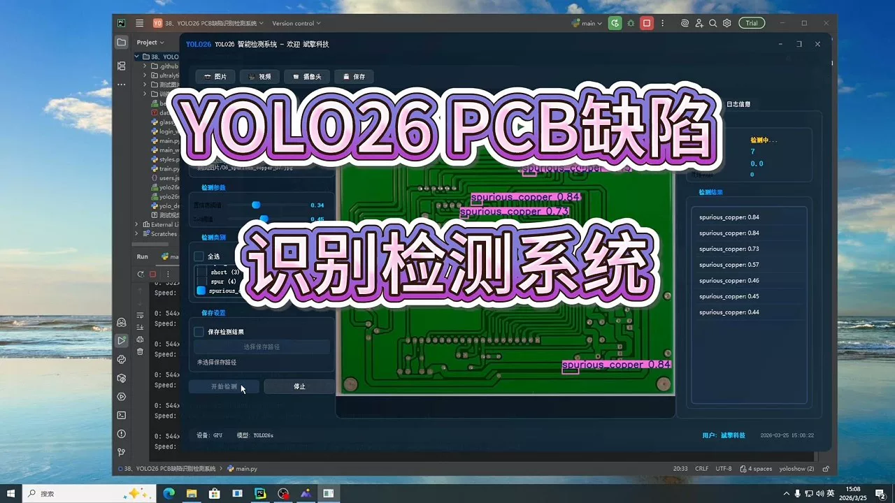
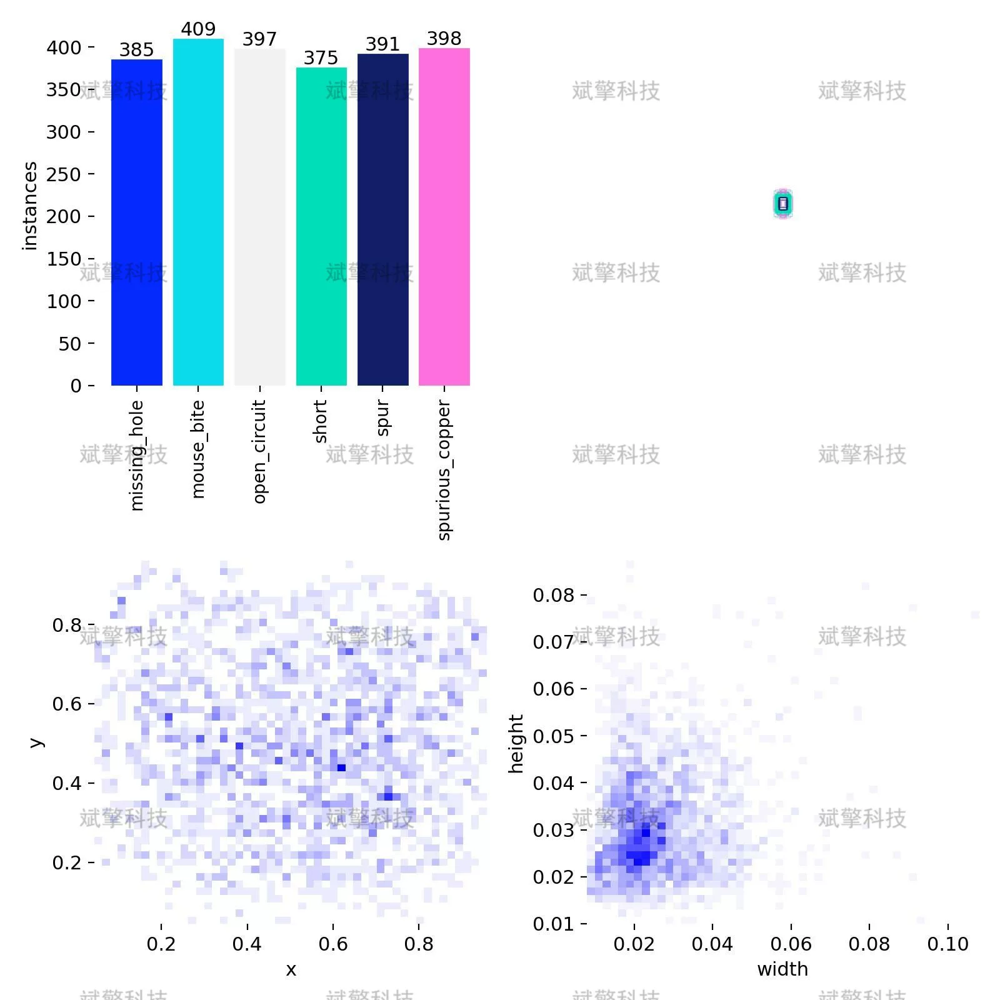
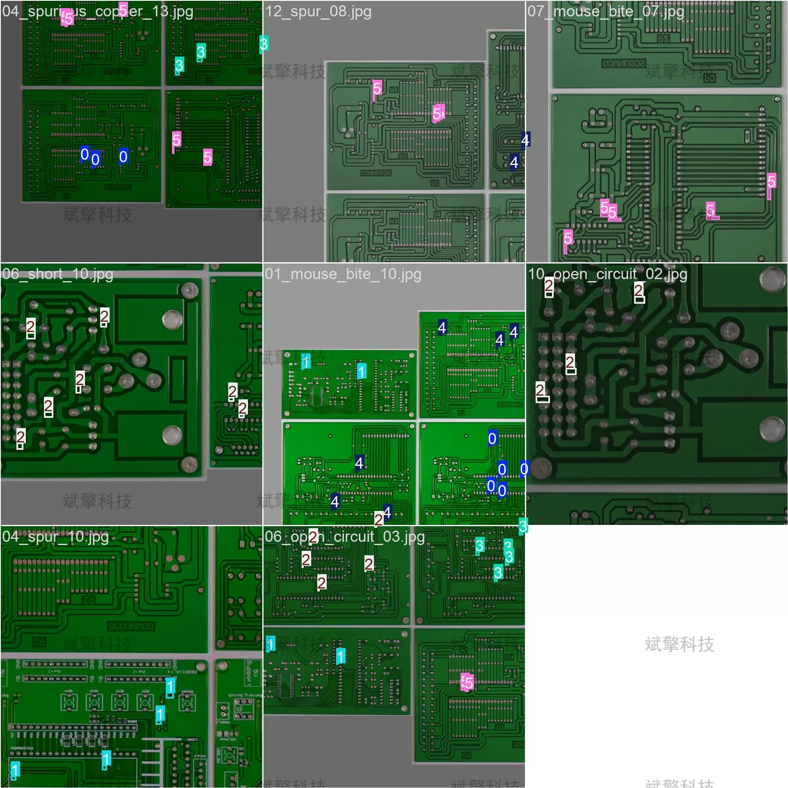
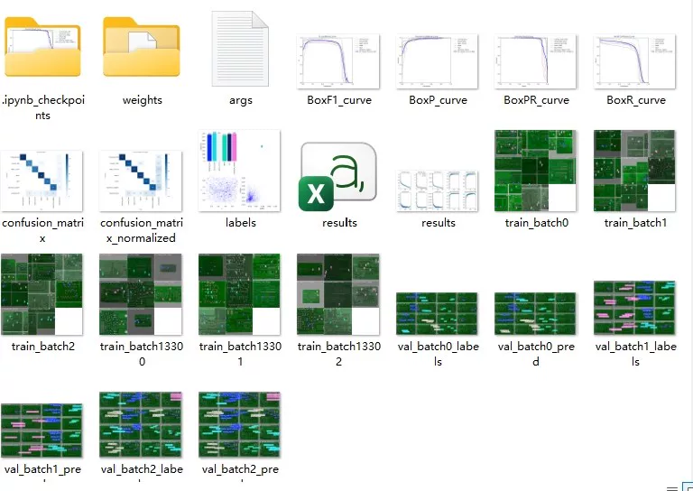
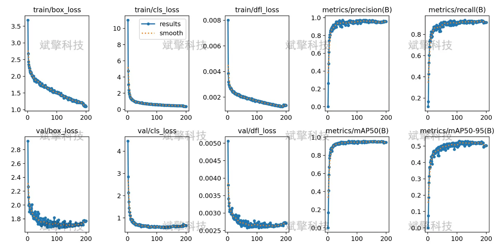
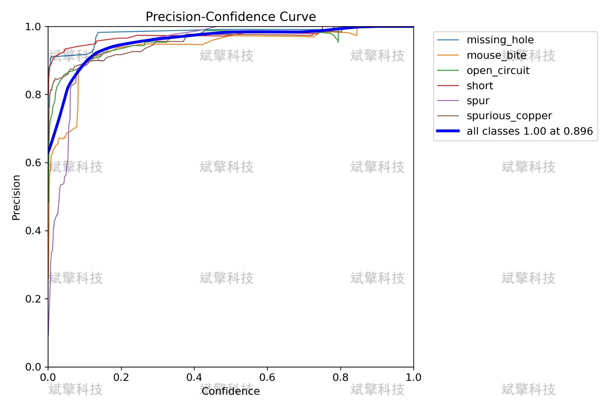
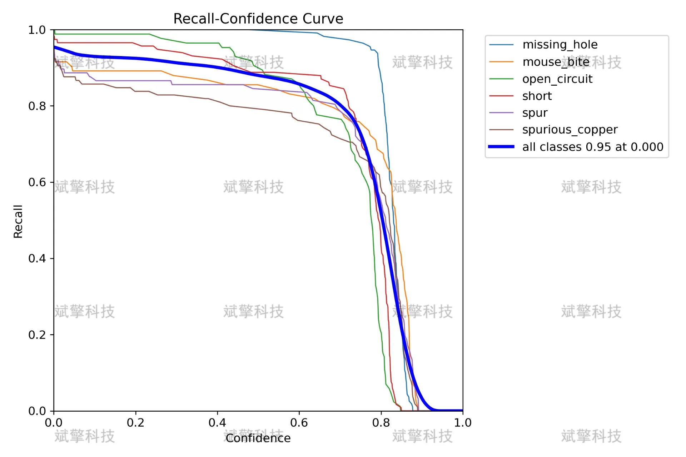
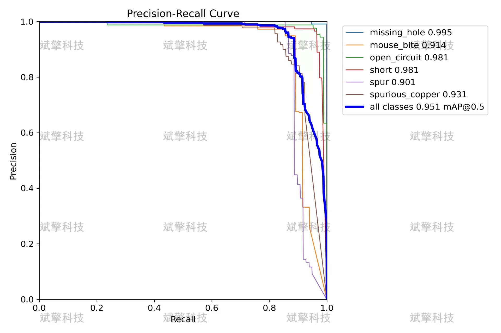
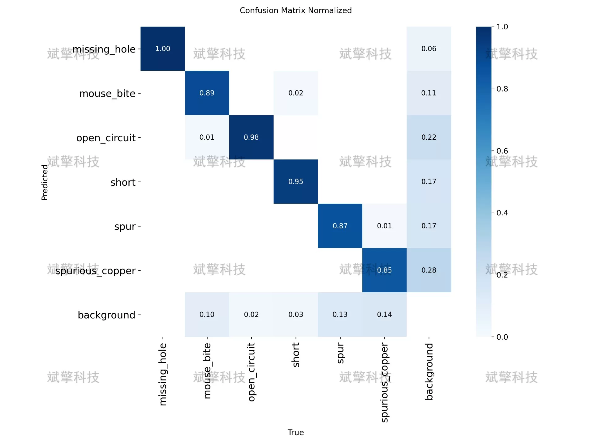

# YOLO26 PCB Defective Detection System | Data Set

## Body

YOLO26 PCB Defect Detection System | Dataset for YOLO26: Automated Detection of Six Types of PCB Defects, Circuit Board Defect Inspection, mAP at 0.951 (Project Source Code + Dataset + Model Weights + UI Interface + Python + Deep Learning + Remote Environment Deployment)

As the electronic manufacturing industry advances towards high precision and high integration, the quality inspection of printed circuit boards (PCBs) has become a critical link in ensuring product reliability. Traditional methods of PCB defect detection rely on manual visual inspection or traditional image processing techniques, which are inefficient and have a high rate of false positives, making them unsuitable for modern industrial automation needs. This study builds an automatic PCB defect recognition system based on the YOLO26 object detection algorithm, covering six common types of defects: missing_hole, mouse_bite, open_circuit, short, spur, and spurious_copper.
The system uses YOLO26 as its foundational architecture, training on 554 images and validating on 139 images, analyzing model performance through multiple evaluation metrics. The experimental results show that the model achieves high accuracy rates across most defect categories, with an overall mAP@0.50 reaching 0.951, and a F1 score of up to 0.94. However, due to the uneven distribution of classes and the scarcity of some defect samples, the model's performance in minority classes such as open_circuit and spurious_copper still needs improvement. This study provides a feasible solution for PCB automated inspection and points out directions for subsequent optimization.
Training set: 554 images
Validation set: 139 images

Defect categories (total six):
Missing Hole, missing_hole, hole not drilled where it should be
Mouse Bite, mouse_bite, depression in line edge resembling mouse bite
Open Circuit, open_circuit, line breakage, signal interruption
Short Circuit, short, accidental connection between adjacent lines
Spur, spur, excess copper foil protrusion on line edge
Spurious Copper, spurious_copper, residual copper foil in non-line area

+80 reservation for remote installation. Unsuccessful installation will result in full refund.
Purchase includes the following resources (unlocked via Baidu Cloud):
   - Complete source code for YOLO detection project
   - YOLO format dataset
   - Training code + UI interface code
   - Trained model + results images
   - Software installer package
   - Add WeChat reservation for remote installation (automatically displayed WeChat ID after purchase) - Unsuccessful installation will result in full refund

⚙️ Core Function Modules
Detection Capability
    Image Detection: upload and immediately detect, returning detection boxes + category information
    Video Detection: supports video files, precise analysis per frame
    Camera Real-time Detection: connects to USB camera for dynamic monitoring
Interaction and Control
    Target Filtering: freely select one or more categories for detection
    Parameter Real-time Adjustment: adjustable confidence threshold & IoU threshold, flexible control over precision
    Result Save: save images/videos/camera detection results in one click
System and Data
    User Login and Registration: Supports password strength check + encryption storage
    Log Recording: automatically records operation and error information (timestamped)

## Images

## Payment

Here is a pay link on Stripe ( https://buy.stripe.com/3cs8yP7sY87d0vu9AB ). Please contact me lonlonago@foxmail.com after funding $89, and I will send you a complete data files , thank you!

